# Fase 1

## 1. Creación de proyecto e invitación del equipo

> Reemplaza los valores entre `<>` por los de tu equipo.

### 1.1 Crear el proyecto en GCP
1. Entra a [Google Cloud Console](https://console.cloud.google.com/) e inicia sesión.
2. En la barra superior, abre **Project selector** → **New Project**.

<div align="center">
  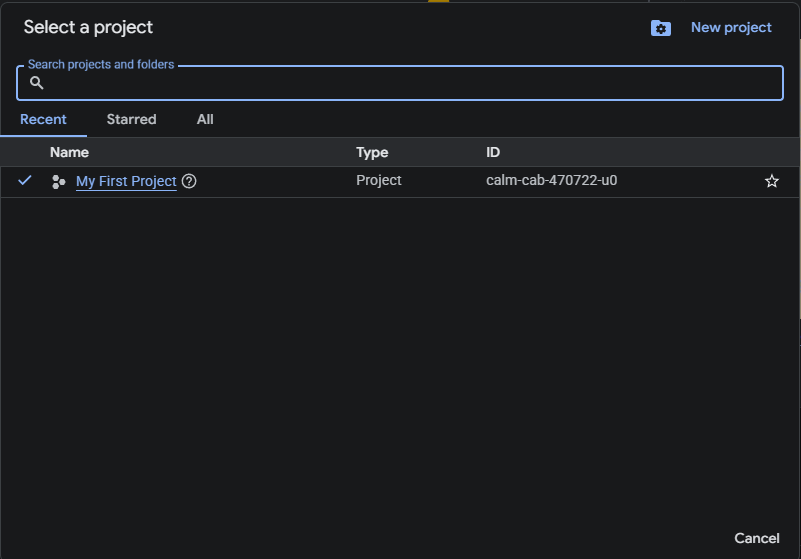
</div>

3. Completa:
   - **Project name:** `<NOMBRE_PROYECTO>` (ej.: `ss2-equipo-07`)
   - **Billing account:** el de tu cuenta (free trial con créditos).
   - **Location/Organization:** deja “No organization” si no aplica.

<div align="center">
  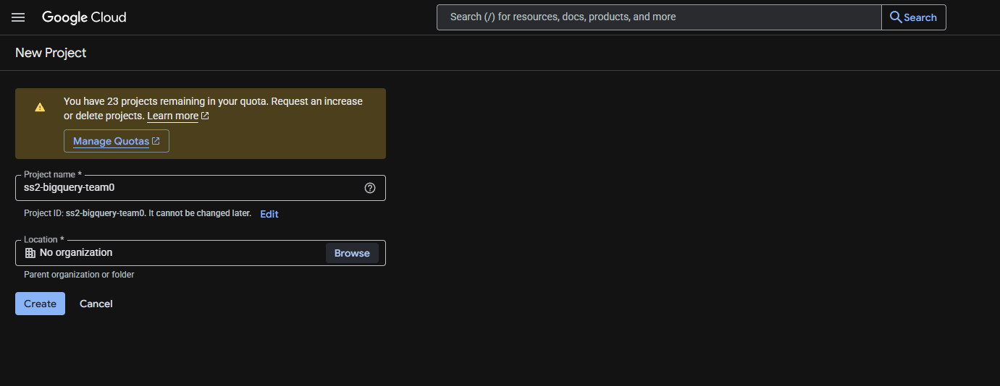
</div>


4. Haz clic en **Create** y selecciona el proyecto recién creado.
5. Activa la API de BigQuery: **APIs & Services → Enable APIs & Services → BigQuery API → Enable**.

<div align="center">
  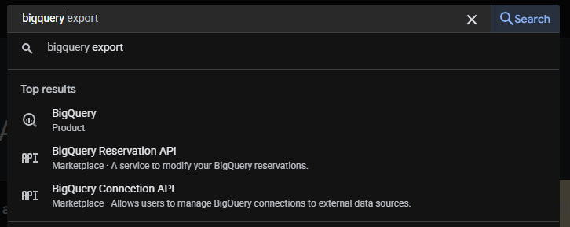
</div>

> Nota: BigQuery define región **por dataset**. En esta fase trabajaremos en **US**.

### 1.2 Invitar a los integrantes (IAM del proyecto)

<div align="center">
  
</div>

1. Ve a **IAM & Admin → IAM → Grant access**.

<div align="center">
  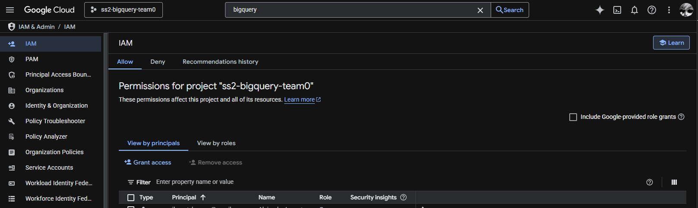
</div>

2. Ingresa el correo del integrante: `<CORREO_INTEGRANTE_2>`
3. Asigna **estos roles a nivel de proyecto**:
   - **Viewer** (`roles/viewer`) – ver recursos del proyecto.
   - **BigQuery Job User** (`roles/bigquery.jobUser`) – ejecutar consultas/jobs facturados al proyecto.
   - **BigQuery User** (`roles/bigquery.user`) – crear *datasets* en el proyecto.
4. Guarda los cambios.

<div align="center">
  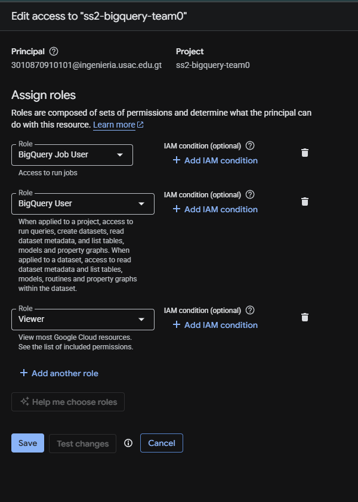
</div>

> ⚠️ No otorgues **Owner** del proyecto. Los permisos finos de edición sobre datos se darán a nivel **dataset** en el siguiente paso (cuando creemos `<DATASET_FASE1>`).

### 1.3 Verificación rápida del acceso (recomendado)
Pídele a `<CORREO_INTEGRANTE_2>` que:
1. Abra **BigQuery Studio** con el proyecto `<NOMBRE_PROYECTO> / <ID_PROYECTO>` seleccionado.
2. Ejecute un **dry-run** (Query settings → *Estimate bytes processed*) de:
   ```sql
   SELECT 1;
   ```
   Si no hay errores, el rol **BigQuery Job User** quedó correcto.

<div align="center">
  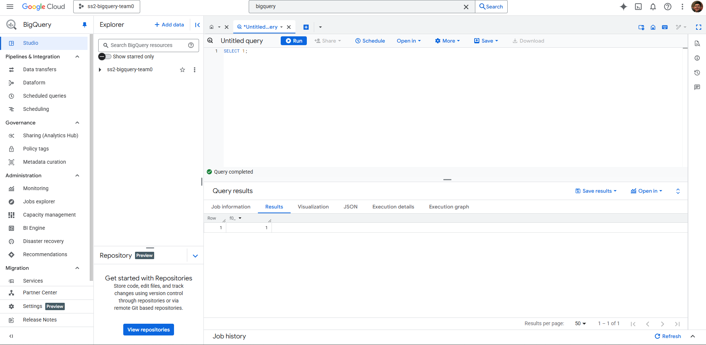
</div>

> En el paso "2. Creación de dataset y tabla derivada" daremos a todos los integrantes rol **BigQuery Data Owner** sobre el dataset `<DATASET_FASE1>` para que puedan crear/modificar tablas dentro de ese dataset sin ser owners del proyecto.

## 2. Creación del dataset y asignación de permisos


> Proyecto de ejemplo: `ss2-bigquery-team0`
> Reemplaza los valores entre `<>` según tu equipo.


### 2.1 Crear el dataset
1. Entra a **BigQuery Studio** con el proyecto `ss2-bigquery-team0` seleccionado.
2. Haz clic en **+ Create dataset**.

<div align="center">
  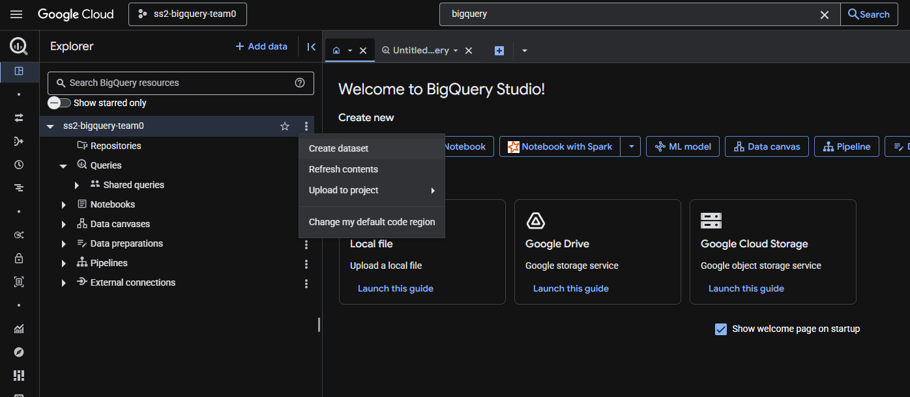
</div>

3. Configura:
- **Dataset ID:** `<DATASET_FASE1>` (ej.: `fase1_dataset`)
- **Location:** `US`
- Deja las demás opciones por defecto.
1. Haz clic en **Create dataset**.


También puedes hacerlo con SQL:
```sql
CREATE SCHEMA IF NOT EXISTS `ss2-bigquery-team0.<DATASET_FASE1>`
OPTIONS (location = "US");
```


### 2.2 Asignar permisos al dataset
1. En el panel izquierdo, selecciona el dataset `<DATASET_FASE1>`.
2. Haz clic en **Sharing → Permissions**.

<div align="center">
  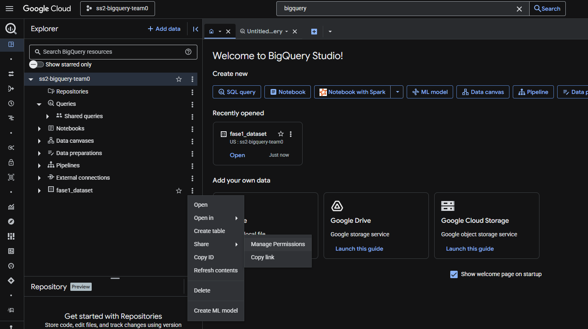
</div>

3. Agrega a los integrantes del grupo:
- `<CORREO_INTEGRANTE_2>`
1. Asigna el rol:
- **BigQuery Data Owner** (`roles/bigquery.dataOwner`) → para crear, modificar y borrar tablas **dentro del dataset**.

<div align="center">
  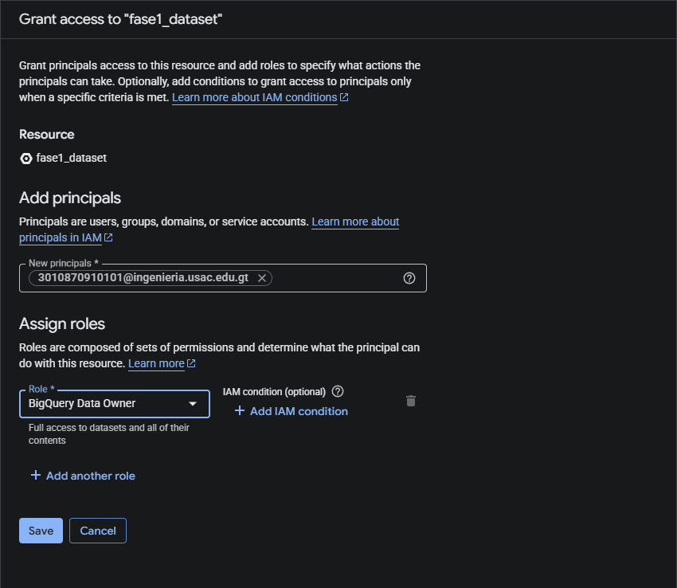
</div>

### 2.3 Verificación del acceso
Pídele a un integrante que cree un tabla prueba:

<div align="center">
  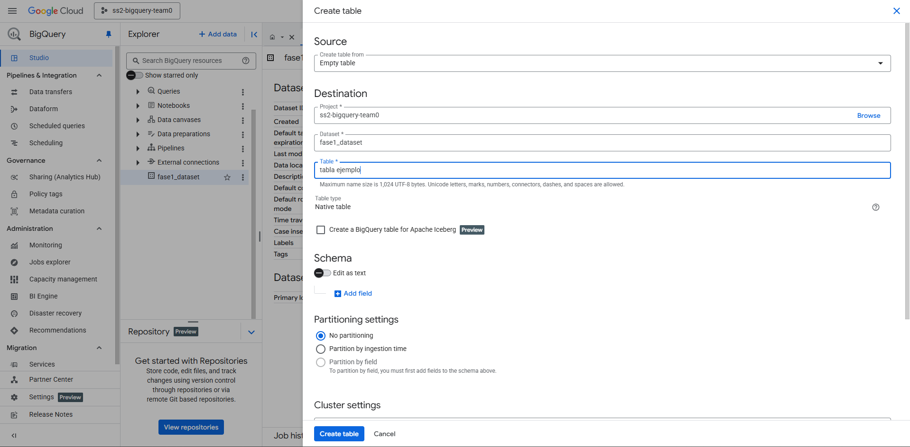
</div>

si se crea sin problemas dentro del proyecto `ss2-bigquery-team0` y dentro del dataset, entonces tiene permisos correctos sobre el dataset `<DATASET_FASE1>`.

<div align="center">
  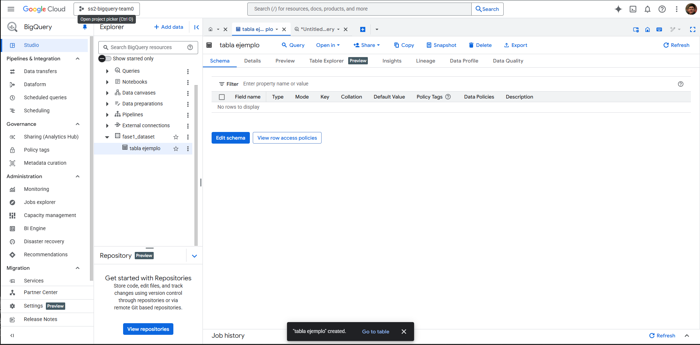
</div>

## 3. Pruebas iniciales con el dataset público
Antes de crear tablas derivadas, hay que validar el dataset de origen.


### 3.1 Ver columnas y tipos de datos
```sql
SELECT
column_name,
data_type
FROM `bigquery-public-data.new_york_taxi_trips.INFORMATION_SCHEMA.COLUMNS`
WHERE table_name = 'tlc_yellow_trips_2022';
```


### 3.2 Contar número total de filas
```sql
SELECT COUNT(*) AS total_viajes
FROM `bigquery-public-data.new_york_taxi_trips.tlc_yellow_trips_2022`;
```


### 3.3 Conteo de valores nulos en campos clave
```sql
SELECT
COUNTIF(passenger_count IS NULL) AS nulos_pasajeros,
COUNTIF(trip_distance IS NULL) AS nulos_distancia,
COUNTIF(total_amount IS NULL) AS nulos_total
FROM `bigquery-public-data.new_york_taxi_trips.tlc_yellow_trips_2022`;
```


### 3.4 Rango de fechas disponibles
```sql
SELECT
MIN(pickup_datetime) AS fecha_min,
MAX(pickup_datetime) AS fecha_max
FROM `bigquery-public-data.new_york_taxi_trips.tlc_yellow_trips_2022`;
```


> Estas pruebas sirven como referencia inicial y garantizan que el dataset público está accesible, completo y en la región correcta (US).

## 4. Interpretación de la ejecución de un Job en BigQuery
Cada consulta en BigQuery se ejecuta como un **Job**. Es importante aprender a leer sus detalles para entender **costos, tiempos y eficiencia**.


### 4.1 Job Information

<div align="center">
  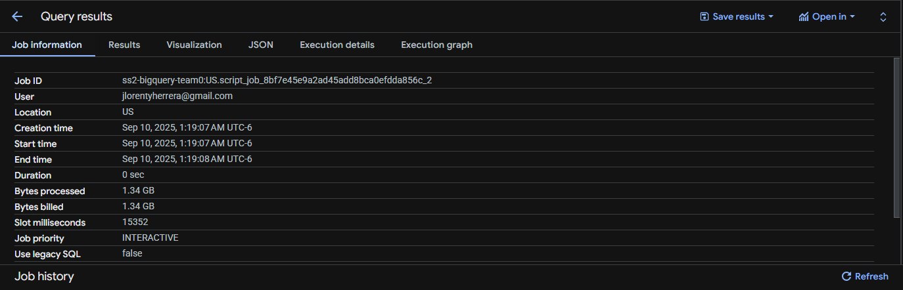
</div>

- **Job ID:** identificador único para rastrear la ejecución.
- **User:** quién ejecutó la consulta.
- **Location:** región donde se procesó (US).
- **Tiempos:** creación, inicio, fin y duración total.
- **Bytes processed / billed:** datos leídos y facturados → clave para evidenciar ahorro con optimización.
- **Slot milliseconds:** recursos de cómputo usados.
- **Priority:** normalmente `INTERACTIVE`.
- **Destination table:** temporal o permanente según la query.


### 4.2 Results

<div align="center">
  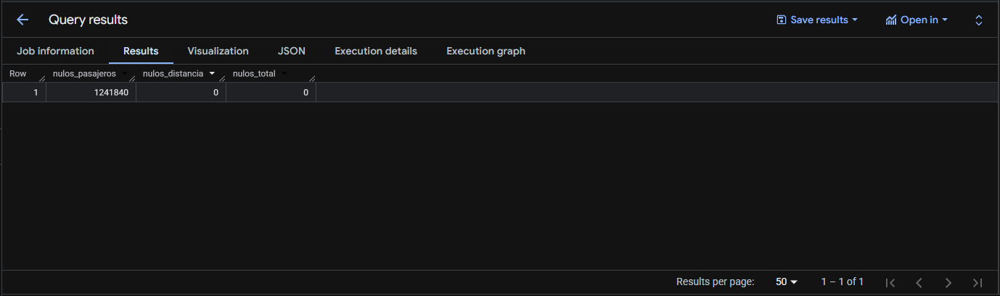
</div>

- Muestra la salida de la consulta.
- Puede exportarse (CSV, JSON, Sheets o a otra tabla en BigQuery).


### 4.3 Visualization

<div align="center">
  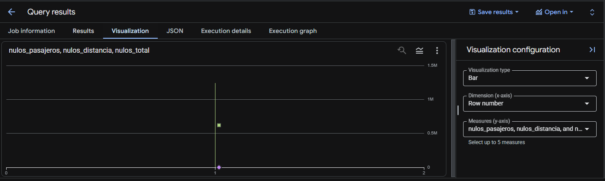
</div>

- Gráficas rápidas de resultados (líneas, barras, etc.).
- Útiles para validar patrones preliminares.


### 4.4 JSON

<div align="center">
  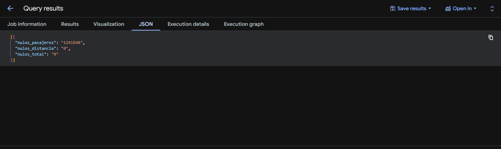
</div>

- Devuelve los resultados en formato JSON.
- Sirve para integraciones con APIs o procesamiento en Python/R.


### 4.5 Execution Details

<div align="center">
  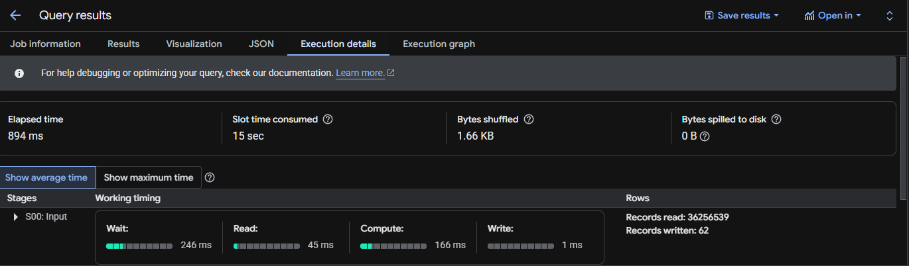
</div>

- **Elapsed time:** duración total.
- **Slot time consumed:** tiempo de slots de cómputo.
- **Bytes shuffled:** datos movidos entre nodos.
- **Stages:** fases de ejecución (lectura, cálculo, escritura).
- Incluye métricas como records leídos y escritos.


### 4.6 Execution Graph

<div align="center">
  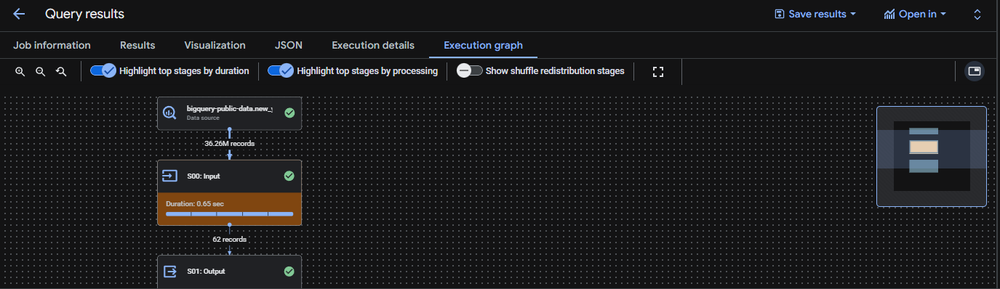
</div>

- Visualiza gráficamente cómo BigQuery dividió el trabajo.
- Etapas: origen de datos, transformaciones, salida.
- Útil para explicar el modelo de procesamiento distribuido.


## 5. Tablas derivadas optimizadas (con correcciones y verificación)


### 5.0 Conceptos clave: Partición y Clustering en BigQuery
- **Partición**: divide físicamente la tabla por una columna de tipo **DATE**, **TIMESTAMP** (usando `DATE(...)` o `TIMESTAMP_TRUNC(...)`) o por **RANGE_BUCKET** en INT64. Filtrar por la columna de partición reduce **bytes procesados**.
- **Clustering**: ordena los datos dentro de cada partición por una o más columnas, acelerando filtros y agrupaciones sobre esas columnas.

> **Regla práctica**: en `CREATE TABLE ... AS SELECT` puedes particionar por una **expresión válida** (p. ej., `DATE(pickup_datetime)`) **o** por una **columna del resultado** (alias) **si esa columna se genera en el `SELECT` final**. Evita referenciar nombres que **no existan** en el resultado (de allí viene el error *Unrecognized name*).

---

## 5.1 Tabla base limpia Q1 — `trips_q1_clean`
**Objetivo:** Subconjunto de enero–marzo 2022 con registros plausibles, manteniendo `pickup_datetime` para máxima compatibilidad.

- **Partición:** `DATE(pickup_datetime)`  
- **Clustering:** `pickup_location_id, dropoff_location_id, payment_type`

```sql
CREATE OR REPLACE TABLE `ss2-bigquery-team0.fase1_dataset.trips_q1_clean`
PARTITION BY DATE(pickup_datetime)
CLUSTER BY pickup_location_id, dropoff_location_id, payment_type AS
SELECT *
FROM `bigquery-public-data.new_york_taxi_trips.tlc_yellow_trips_2022`
WHERE data_file_month BETWEEN 1 AND 3
  AND trip_distance > 0
  AND total_amount >= 0
  AND fare_amount >= 0
  AND passenger_count BETWEEN 1 AND 6;
```

#### Chequeos
```sql
-- Esquema (confirmar que existe pickup_datetime TIMESTAMP)
SELECT column_name, data_type
FROM `ss2-bigquery-team0.fase1_dataset.INFORMATION_SCHEMA.COLUMNS`
WHERE table_name = 'trips_q1_clean'
ORDER BY column_name;

-- Particiones creadas (muestran días)
SELECT partition_id, total_rows
FROM `ss2-bigquery-team0.fase1_dataset.INFORMATION_SCHEMA.PARTITIONS`
WHERE table_name = 'trips_q1_clean'
ORDER BY partition_id
LIMIT 20;
```

---

## 5.2 Demanda por hora y zona — `hourly_demand_q1`
**Objetivo:** Agregados diarios por hora y zona para dashboards y análisis de picos.

- **Partición:** `DATE(pickup_datetime)`  
- **Clustering:** `pickup_location_id, hour_of_day`

```sql
CREATE OR REPLACE TABLE `ss2-bigquery-team0.fase1_dataset.hourly_demand_q1`
PARTITION BY DATE(pickup_datetime)
CLUSTER BY pickup_location_id, hour_of_day AS
SELECT
  pickup_location_id,
  EXTRACT(HOUR FROM pickup_datetime) AS hour_of_day,
  DATE(pickup_datetime) AS pickup_date,
  COUNT(*) AS trips,
  -- Conservamos pickup_datetime para permitir el PARTITION BY correcto
  ANY_VALUE(pickup_datetime) AS pickup_datetime
FROM `ss2-bigquery-team0.fase1_dataset.trips_q1_clean`
GROUP BY pickup_location_id, hour_of_day, pickup_date;
```

#### Chequeos
```sql
-- Confirmar columnas y tipos
SELECT column_name, data_type
FROM `ss2-bigquery-team0.fase1_dataset.INFORMATION_SCHEMA.COLUMNS`
WHERE table_name = 'hourly_demand_q1'
ORDER BY column_name;

-- Ver particiones
SELECT partition_id, total_rows
FROM `ss2-bigquery-team0.fase1_dataset.INFORMATION_SCHEMA.PARTITIONS`
WHERE table_name = 'hourly_demand_q1'
ORDER BY partition_id
LIMIT 20;

-- Consulta que aprovecha partición y cluster
SELECT SUM(trips) AS viajes_zona_hora
FROM `ss2-bigquery-team0.fase1_dataset.hourly_demand_q1`
WHERE DATE(pickup_datetime) = '2022-02-15'
  AND pickup_location_id = '237'
  AND hour_of_day BETWEEN 7 AND 9;
```

> **Nota**: Si prefieres no conservar `pickup_datetime`, puedes particionar por `pickup_date`, pero entonces asegúrate de que `pickup_date` **exista** en el resultado y úsalo directamente en `PARTITION BY pickup_date`.

---

## 5.3 Resumen mensual — `monthly_metrics_q1` (corregida)
**Objetivo:** KPIs por mes y método de pago.

- **Partición:** por la columna **`month_date`** (DATE) generada en el `SELECT`.  
- **Clustering:** `payment_type`

```sql
CREATE OR REPLACE TABLE `ss2-bigquery-team0.fase1_dataset.monthly_metrics_q1`
PARTITION BY month_date
CLUSTER BY payment_type AS
SELECT
  DATE_TRUNC(DATE(pickup_datetime), MONTH) AS month_date,  -- genera la columna de partición
  payment_type,
  COUNT(*) AS trips,
  ROUND(AVG(trip_distance), 2) AS avg_distance,
  ROUND(AVG(total_amount), 2) AS avg_total,
  ROUND(AVG(tip_amount), 2) AS avg_tip
FROM `ss2-bigquery-team0.fase1_dataset.trips_q1_clean`
GROUP BY month_date, payment_type;
```

#### Chequeos
```sql
-- Esquema: confirmar que month_date es DATE
SELECT column_name, data_type
FROM `ss2-bigquery-team0.fase1_dataset.INFORMATION_SCHEMA.COLUMNS`
WHERE table_name = 'monthly_metrics_q1'
ORDER BY column_name;

-- Particiones mensuales (IDs como 2022-01-01, 2022-02-01, ...)
SELECT partition_id, total_rows
FROM `ss2-bigquery-team0.fase1_dataset.INFORMATION_SCHEMA.PARTITIONS`
WHERE table_name = 'monthly_metrics_q1'
ORDER BY partition_id;

-- Serie temporal de KPI
SELECT month_date, SUM(trips) AS total_trips
FROM `ss2-bigquery-team0.fase1_dataset.monthly_metrics_q1`
GROUP BY month_date
ORDER BY month_date;
```

---

## 5.4 Distribución de propinas — `tips_buckets_q1` (corregida)
**Objetivo:** Categorías de propina listas para visualización.

- **Partición:** por la columna **`month_date`** (DATE) generada en el `WITH base`.  
- **Clustering:** `tip_bucket`

```sql
CREATE OR REPLACE TABLE `ss2-bigquery-team0.fase1_dataset.tips_buckets_q1`
PARTITION BY month_date
CLUSTER BY tip_bucket AS
WITH base AS (
  SELECT
    DATE_TRUNC(DATE(pickup_datetime), MONTH) AS month_date,  -- genera la columna de partición
    CASE
      WHEN tip_amount = 0 THEN 'Sin propina'
      WHEN tip_amount <= 2 THEN 'Hasta 2 USD'
      WHEN tip_amount <= 5 THEN '2–5 USD'
      WHEN tip_amount <= 10 THEN '5–10 USD'
      ELSE 'Más de 10 USD'
    END AS tip_bucket
  FROM `ss2-bigquery-team0.fase1_dataset.trips_q1_clean`
)
SELECT
  month_date,
  tip_bucket,
  COUNT(*) AS trips
FROM base
GROUP BY month_date, tip_bucket;
```

#### Chequeos
```sql
-- Esquema
SELECT column_name, data_type
FROM `ss2-bigquery-team0.fase1_dataset.INFORMATION_SCHEMA.COLUMNS`
WHERE table_name = 'tips_buckets_q1'
ORDER BY column_name;

-- Particiones mensuales
SELECT partition_id, total_rows
FROM `ss2-bigquery-team0.fase1_dataset.INFORMATION_SCHEMA.PARTITIONS`
WHERE table_name = 'tips_buckets_q1'
ORDER BY partition_id;

-- Distribucion por bucket
SELECT tip_bucket, SUM(trips) AS total
FROM `ss2-bigquery-team0.fase1_dataset.tips_buckets_q1`
GROUP BY tip_bucket
ORDER BY total DESC;
```

---

## 5.5 Cómo estimar bytes procesados y proteger costos
- En la consola, el editor muestra un ✔️ con *“This query will process X ...”* antes de ejecutar (estimación de bytes).  
- Define **Maximum bytes billed** en *Query settings* para evitar ejecuciones costosas.  
- CLI: `bq query --use_legacy_sql=false --dry_run 'SELECT ...'`  
- API: `dryRun=true` en el job.


## Medición correcta de bytes procesados en BigQuery

Al evaluar optimización con **particiones** y **clustering**, es común confundirse porque:
- BigQuery puede responder consultas como `COUNT(*)` usando **metadata**, mostrando `0 B processed`.
- Si está activa la opción **Use cached results**, las queries repetidas devuelven `0 B processed` por la caché.

Para medir correctamente, se recomienda:

---

### 1. Desactivar la caché
En la consola, abre **Query settings** y desactiva **Use cached results**.

---

### 2. Comparar rangos amplios vs rangos acotados
Ejemplo con la tabla `trips_q1_clean`:

```sql
-- Q1 completo (enero a marzo)
SELECT COUNT(*) AS filas_q1
FROM `ss2-bigquery-team0.fase1_dataset.trips_q1_clean`
WHERE DATE(pickup_datetime) BETWEEN '2022-01-01' AND '2022-03-31';
```

```sql
-- Solo febrero (subconjunto menor)
SELECT COUNT(*) AS filas_febrero
FROM `ss2-bigquery-team0.fase1_dataset.trips_q1_clean`
WHERE DATE(pickup_datetime) BETWEEN '2022-02-01' AND '2022-02-28';
```

Esperado: la consulta de Q1 procesa más bytes que la de febrero, evidenciando el pruning de particiones.

---

### 3. Forzar lectura de columnas
Para evitar que `COUNT(*)` use solo metadata, cuenta sobre una columna:

```sql
-- Q1 completo
SELECT COUNT(trip_distance) AS filas_q1
FROM `ss2-bigquery-team0.fase1_dataset.trips_q1_clean`
WHERE DATE(pickup_datetime) BETWEEN '2022-01-01' AND '2022-03-31';
```

```sql
-- Solo febrero
SELECT COUNT(trip_distance) AS filas_febrero
FROM `ss2-bigquery-team0.fase1_dataset.trips_q1_clean`
WHERE DATE(pickup_datetime) BETWEEN '2022-02-01' AND '2022-02-28';
```

Esto obliga a BigQuery a leer datos reales, mostrando bytes procesados.

---

### 4. Evidencia con clustering
Si además filtras por columnas de clustering (ej. `pickup_location_id`), los bytes bajan aún más:

```sql
SELECT COUNT(trip_distance)
FROM `ss2-bigquery-team0.fase1_dataset.trips_q1_clean`
WHERE DATE(pickup_datetime) BETWEEN '2022-02-01' AND '2022-02-28'
  AND pickup_location_id = '237';
```

---

## Resumen para estudiantes
1. **Desactivar caché** antes de medir.
2. Usar rangos amplios vs acotados en `WHERE`.
3. Contar sobre una columna para evitar optimización por metadata.
4. Capturar capturas de pantalla de **Job Information** → *Bytes processed* y *Bytes billed* como evidencia de optimización.

## 6. Consultas exploratorias para dashboard

### 6.1 Serie temporal de viajes por mes
**Qué muestra:** total de viajes por mes (Q1). Útil para línea temporal.

**Cómo:** usamos la tabla particionada `monthly_metrics_q1` (una fila por `month_date` y `payment_type`) y **agregamos**.

```sql
-- Total de viajes por mes
SELECT
  month_date,                   -- 1er día de cada mes
  SUM(trips) AS total_viajes
FROM `ss2-bigquery-team0.fase1_dataset.monthly_metrics_q1`
-- Partición mensual: opcional, acota rango
WHERE month_date BETWEEN '2022-01-01' AND '2022-03-01'
GROUP BY month_date
ORDER BY month_date;
```

<div align="center">
  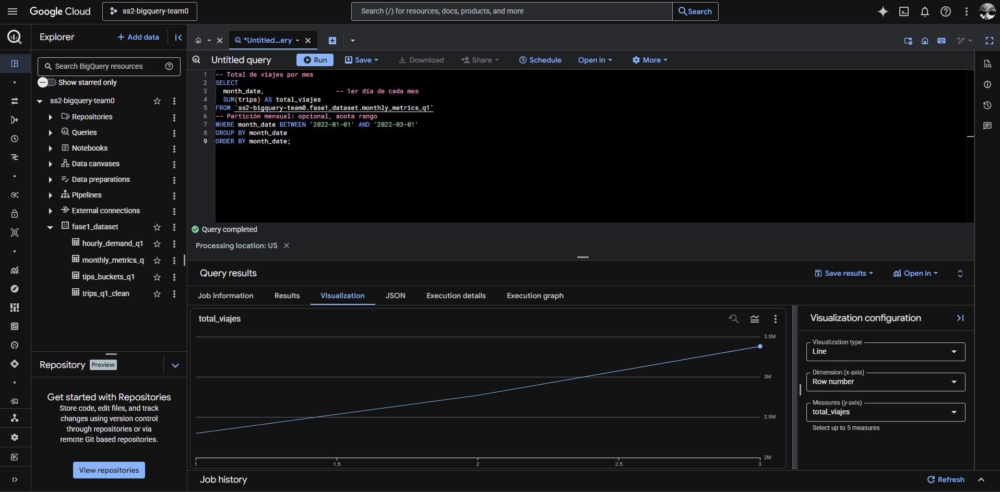
</div>

**KPI avanzados (promedios ponderados):** si quieres tarifa/distancia promedio **global** por mes, pondera por número de viajes.

```sql
-- Promedios ponderados por mes (evita promediar promedios)
SELECT
  month_date,
  SUM(trips) AS total_viajes,
  ROUND(SAFE_DIVIDE(SUM(avg_total * trips), SUM(trips)), 2)    AS tarifa_promedio,
  ROUND(SAFE_DIVIDE(SUM(avg_distance * trips), SUM(trips)), 2) AS distancia_promedio
FROM `ss2-bigquery-team0.fase1_dataset.monthly_metrics_q1`
WHERE month_date BETWEEN '2022-01-01' AND '2022-03-01'
GROUP BY month_date
ORDER BY month_date;
```

<div align="center">
  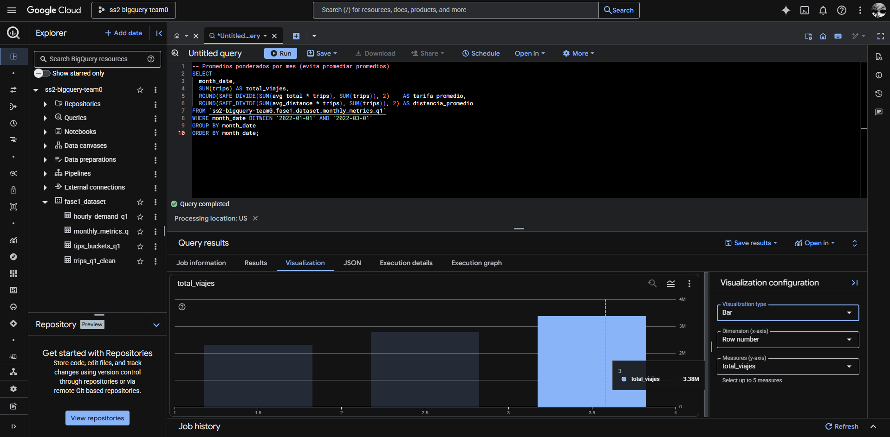
</div>


**Rendimiento:** `monthly_metrics_q1` está **particionada por mes** (`month_date`). El filtro en `WHERE` reduce bytes.

---

### 6.2 Demanda por hora del día
**Qué muestra:** el patrón de viajes por hora (picos de demanda). Ideal para barras o heatmap.

**Cómo:** usamos `hourly_demand_q1`, ya agregada por **fecha** y **hora**; sumamos a nivel de hora.

```sql
-- Viajes por hora en febrero (usa partición por fecha)
SELECT
  hour_of_day AS hora,
  SUM(trips) AS total_viajes
FROM `ss2-bigquery-team0.fase1_dataset.hourly_demand_q1`
WHERE DATE(pickup_datetime) BETWEEN '2022-02-01' AND '2022-02-28'
GROUP BY hora
ORDER BY hora;
```

<div align="center">
  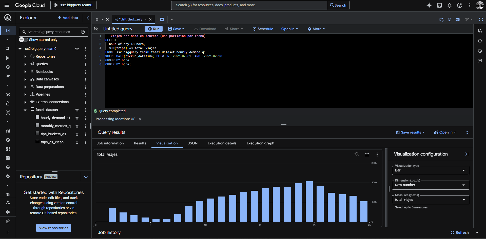
</div>

**Heatmap hora x zona (base para mapa de calor):**
```sql
SELECT
  pickup_location_id,
  hour_of_day,
  SUM(trips) AS total_viajes
FROM `ss2-bigquery-team0.fase1_dataset.hourly_demand_q1`
WHERE DATE(pickup_datetime) BETWEEN '2022-02-01' AND '2022-02-28'
GROUP BY pickup_location_id, hour_of_day
ORDER BY pickup_location_id, hour_of_day;
```

<div align="center">
  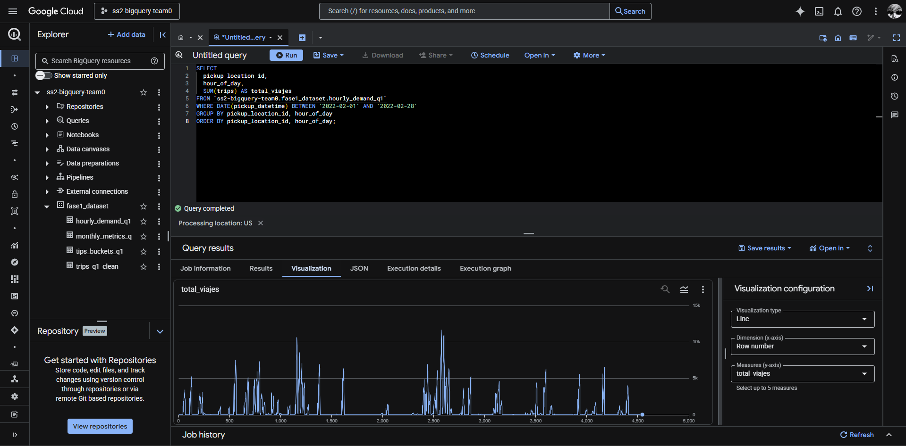
</div>

**Rendimiento:** esta tabla está **particionada por `DATE(pickup_datetime)`** y **clusterizada** por `(pickup_location_id, hour_of_day)`. Filtrar por fecha y, si es posible, por zona acelera y reduce bytes.

---

### 6.3 Métodos de pago (participación y conteos)
**Qué muestra:** popularidad de cada método de pago.

**Cómo:** sumamos los viajes por `payment_type` en el trimestre usando `monthly_metrics_q1`.

```sql
-- Conteo por método de pago en Q1
SELECT
  payment_type,
  SUM(trips) AS total_viajes
FROM `ss2-bigquery-team0.fase1_dataset.monthly_metrics_q1`
WHERE month_date BETWEEN '2022-01-01' AND '2022-03-01'
GROUP BY payment_type
ORDER BY total_viajes DESC;
```

<div align="center">
  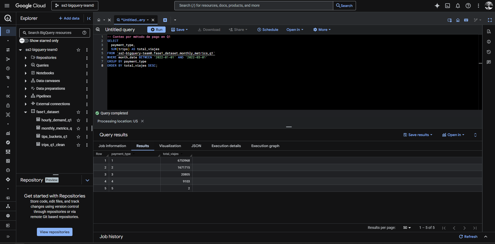
</div>

**Participación (% del total):**
```sql
WITH agg AS (
  SELECT payment_type, SUM(trips) AS total_viajes
  FROM `ss2-bigquery-team0.fase1_dataset.monthly_metrics_q1`
  WHERE month_date BETWEEN '2022-01-01' AND '2022-03-01'
  GROUP BY payment_type
)
SELECT
  payment_type,
  total_viajes,
  ROUND(100 * SAFE_DIVIDE(total_viajes, SUM(total_viajes) OVER ()), 2) AS porcentaje
FROM agg
ORDER BY total_viajes DESC;
```

<div align="center">
  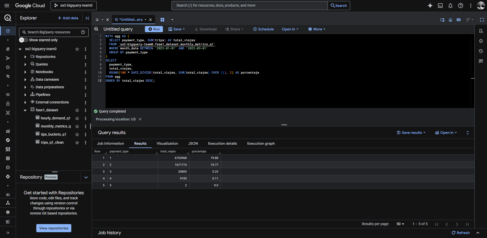
</div>

> Nota: si quieres **renombrar tipos** (p. ej., "1 = Tarjeta", "2 = Efectivo"), usa `CASE WHEN` sobre `payment_type`. Verifica primero los valores reales en tu tabla.

---

### 6.4 Distribución de propinas
**Qué muestra:** proporción de viajes por rango de propina.

**Cómo:** la tabla `tips_buckets_q1` ya trae `tip_bucket` y conteos por mes.

```sql
-- Distribución total Q1
SELECT
  tip_bucket,
  SUM(trips) AS total_viajes
FROM `ss2-bigquery-team0.fase1_dataset.tips_buckets_q1`
WHERE month_date BETWEEN '2022-01-01' AND '2022-03-01'
GROUP BY tip_bucket
ORDER BY total_viajes DESC;
```
<div align="center">
  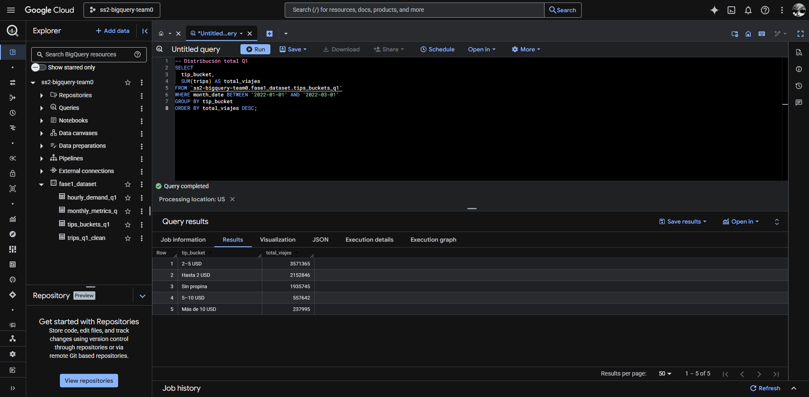
</div>

**Por mes (para gráficas apiladas):**
```sql
SELECT
  month_date,
  tip_bucket,
  SUM(trips) AS total_viajes
FROM `ss2-bigquery-team0.fase1_dataset.tips_buckets_q1`
WHERE month_date BETWEEN '2022-01-01' AND '2022-03-01'
GROUP BY month_date, tip_bucket
ORDER BY month_date, tip_bucket;
```

<div align="center">
  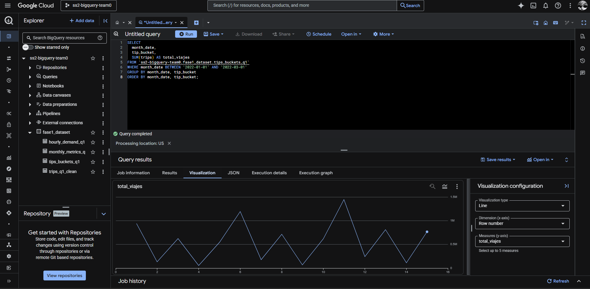
</div>

**Rendimiento:** `tips_buckets_q1` está **particionada por `month_date`** y **clusterizada** por `tip_bucket`. Filtrar por mes reduce bytes.

---

### 6.5 Top 10 zonas con más viajes
**Qué muestra:** ranking de zonas de origen con mayor actividad (útil para decisiones operativas).

**Cómo:** agregamos sobre la tabla base `trips_q1_clean`.

```sql
SELECT
  pickup_location_id,
  COUNT(*) AS total_viajes
FROM `ss2-bigquery-team0.fase1_dataset.trips_q1_clean`
WHERE DATE(pickup_datetime) BETWEEN '2022-01-01' AND '2022-03-31'
GROUP BY pickup_location_id
ORDER BY total_viajes DESC
LIMIT 10;
```

<div align="center">
  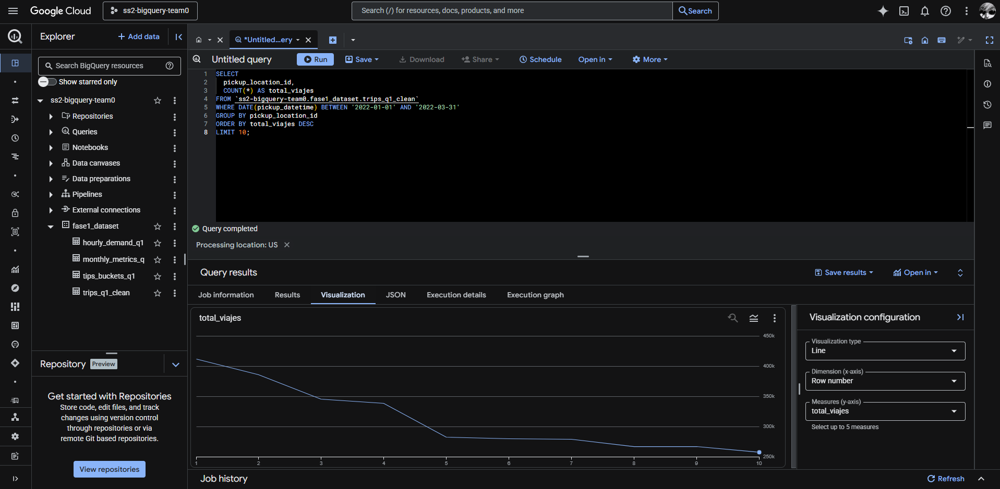
</div>

**Rendimiento:** filtra por la **columna de partición** `DATE(pickup_datetime)` para prune de particiones.

---

## 6.6 Recordatorios de sintaxis SQL
- Toda columna **no agregada** que aparezca en `SELECT` debe ir en `GROUP BY` (o usar funciones ventana).
- `EXTRACT(part FROM timestamp)` obtiene partes de fecha/hora; `DATE_TRUNC(date, MONTH)` recorta al primer día del mes.
- `SAFE_DIVIDE(a, b)` evita error por división entre cero.
- Puedes **ordenar por alias** declarado en el `SELECT` (ej.: `ORDER BY total_viajes`).

---

## 6.7 Preparación para visualización
- **Google Sheets**: ejecuta la consulta y usa **Export → Google Sheets**.
- **Looker Studio**: conecta la tabla (o vista) y usa:
  - Serie temporal: `month_date` vs `total_viajes`.
  - Barras: `payment_type` vs `total_viajes`.
  - Pie o barras apiladas: `tip_bucket` vs `total_viajes`.
  - Heatmap: `hour_of_day` x `pickup_location_id` vs `total_viajes`.

**Consejo:** fija **Maximum bytes billed** en *Query settings* para evitar ejecuciones costosas por accidente.

## 7. Visualización en Looker Studio (Dashboard)

### 7.1 Conexión de datos
1. Ingresar a [Looker Studio](https://lookerstudio.google.com/).
2. Crear un **nuevo reporte**.

<div align="center">
  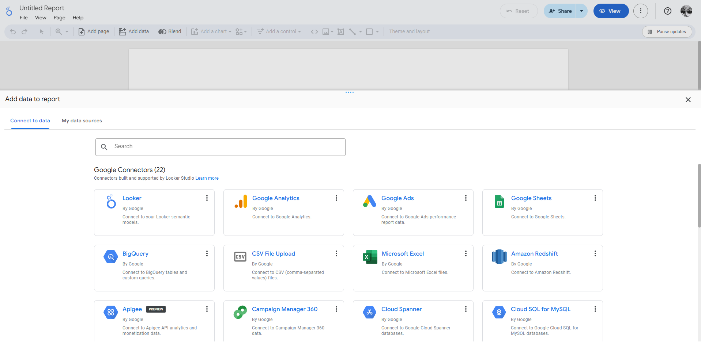
</div>

3. Hacer clic en **Agregar fuente de datos** → seleccionar **BigQuery**.
4. Navegar hasta el proyecto `ss2-bigquery-team0` → dataset `fase1_dataset`.

<div align="center">
  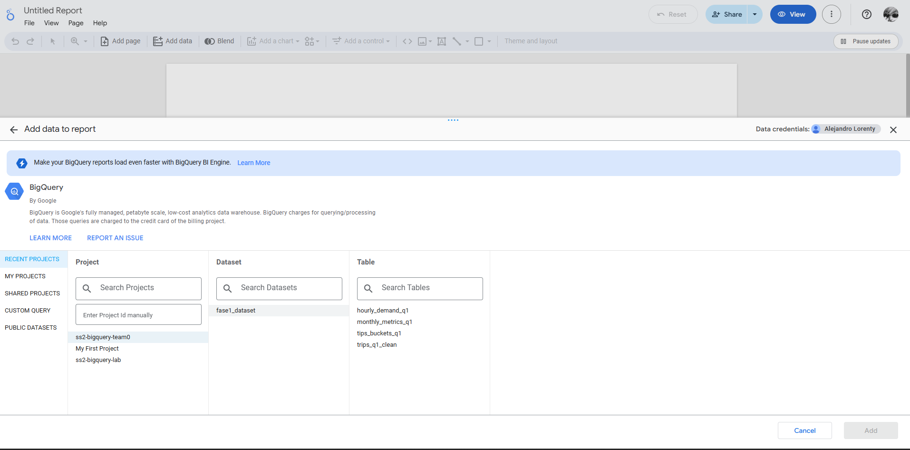
</div>

5. Conectar cada una de las tablas derivadas:
   - `monthly_metrics_q1` (métricas mensuales, KPIs financieros).
   - `hourly_demand_q1` (patrones por hora y zona).
   - `tips_buckets_q1` (propinas por rangos).
   - `trips_q1_clean` (base limpia para consultas ad-hoc, top zonas).

<div align="center">
  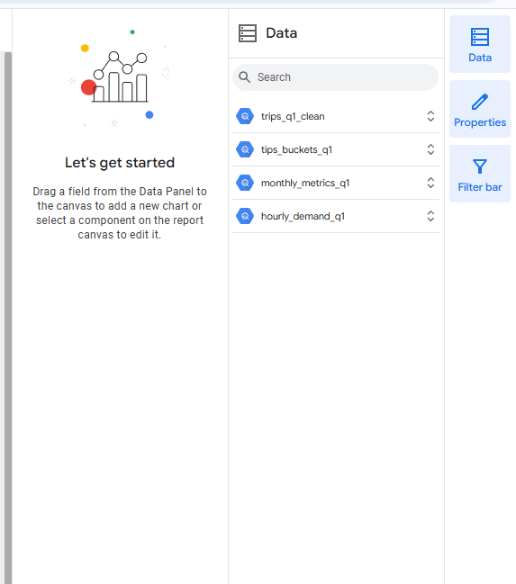
</div>

👉 **Nota:** No es necesario juntar todo en un solo query. Looker Studio permite trabajar con múltiples fuentes en un mismo tablero.

---

### 7.2 Construcción de visualizaciones

#### a) KPI Cards
- **Fuente:** `monthly_metrics_q1`.
- **Métricas:**
  - `SUM(trips)` → total viajes.
  - Promedio tarifa (ponderado) → `ROUND(SUM(avg_total * trips)/SUM(trips),2)`.
  - % de viajes con propina (se calcula en SQL o como campo derivado).
- **Visualización:** Scorecards en la parte superior.

#### b) Serie temporal de viajes por mes
- **Fuente:** `monthly_metrics_q1`.
- **Dimensión:** `month_date`.
- **Métrica:** `SUM(trips)`.
- **Visualización:** Serie temporal (línea).

#### c) Métodos de pago
- **Fuente:** `monthly_metrics_q1`.
- **Dimensión:** `payment_type`.
- **Métrica:** `SUM(trips)`.
- **Visualización:** Barras horizontales.
- **Orden:** mayor a menor.

<div align="center">
  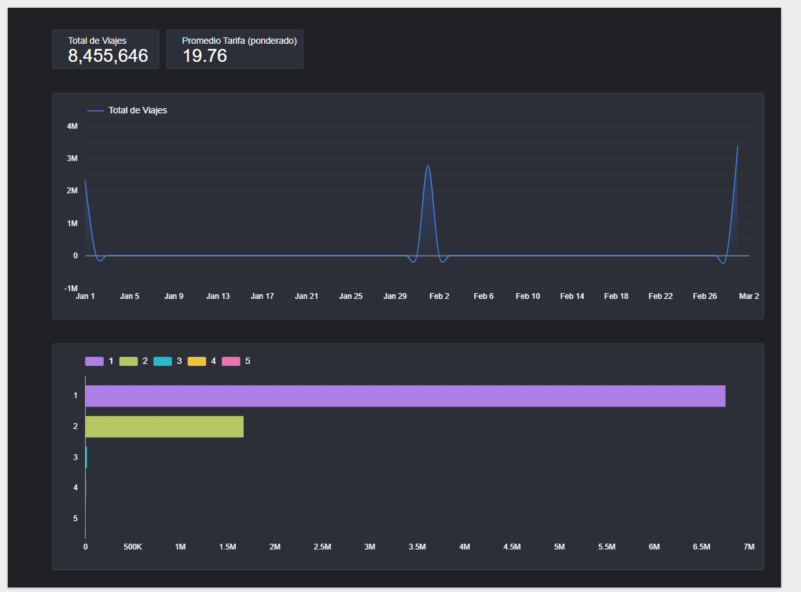
</div>

#### d) Distribución de propinas
- **Fuente:** `tips_buckets_q1`.
- **Dimensión:** `tip_bucket`.
- **Métrica:** `SUM(trips)`.
- **Visualización:** Pie chart o barras apiladas.

#### e) Demanda por hora
- **Fuente:** `hourly_demand_q1`.
- **Dimensión:** `hour_of_day`.
- **Métrica:** `SUM(trips)`.
- **Visualización:** Barras verticales.
- **Extensión:** añadir `pickup_location_id` para heatmap hora x zona.

#### f) Top zonas
- **Fuente:** `trips_q1_clean`.
- **Dimensión:** `pickup_location_id`.
- **Métrica:** `COUNT(*)`.
- **Visualización:** Barras o tabla.
- **Config:** limitar a top 10.


<div align="center">
  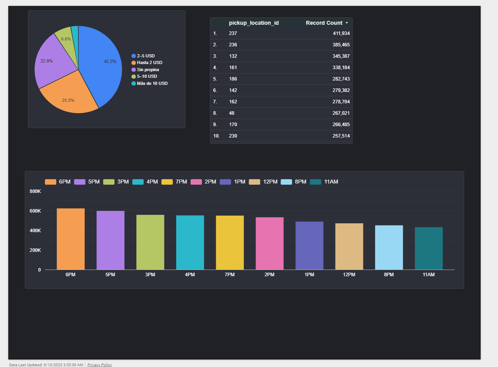
</div>

---

### 7.3 Filtros y controles
- **Date range control**: filtro global por fechas.
- **Dropdowns**:
  - Zona (pickup_location_id).
  - Método de pago (payment_type).
  - Rango de propina (tip_bucket).
- Configurar filtros como **globales** para que afecten todos los gráficos.

---

### 7.4 Buenas prácticas de diseño
- **Claridad** antes que complejidad: un gráfico = una pregunta.
- **Consistencia visual:** mismos colores y tipografías.
- **Espacios en blanco:** evita saturar.
- **Etiquetas claras:** títulos y unidades explícitos.
- **Textos breves:** añade contexto para insights importantes.
- Evitar más de 20–25 elementos por página.

---

### 7.5 Rendimiento y eficiencia
- Evita cargar tablas completas con miles de filas.
- Limita campos en gráficos (<50).
- Usa filtros de partición y clustering en BigQuery.
- Configura **Maximum bytes billed** en la conexión.
- Si el tablero se vuelve lento → usar conector **Extract Data** en Looker Studio.

---
